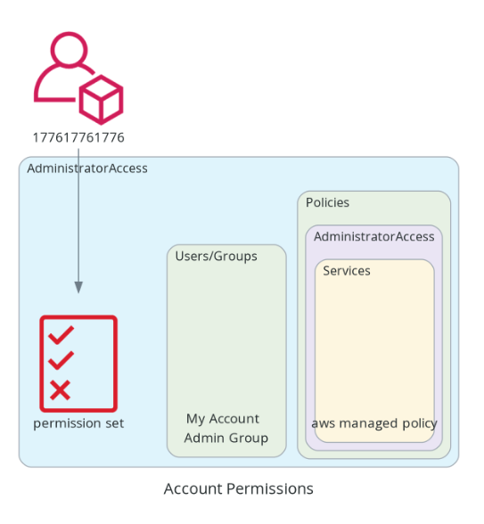

<h1 align="center">
  <br>
  
  <br>
  AWS IDC Permissions Diagram
  <br>
</h1>

<h4 align="center">Ah, AWS IDC permission sets - where complexity goes to party and there are no noise complaints becauses they are better than the alertnative! I've wrangled some containerized logic to help visualize the applied permission sets for an account.</h4>

<p align="center">
  <a href="#how-to-use">How to Use</a> •
  <a href="#environment-variables">Environment Variables</a>
</p>

## How to Use

1. clone the repo
2. inside the repo directory run the following
   > make sure to update the env vars

```bash
docker build . -t aws-idc-permissions-diagram
docker run -it -v $(pwd):/app -w /app -e ACCOUNT_ID=177617761776 -e GRANULAR=1 -e REGION=us-east-1 -e INSTANCE_ARN=arn:aws:sso:::instance/ssoins-111111111111111 -e DIRECTORY_STORE=d-123456789 aws-idc-permissions-diagram /bin/bash
```

3. inside container, configure aws credentials. I paste an sts token into the environment from the AWS access portal. these credentials need to be for the payer account or account that has your org Identity Center.

4.execute the script

```bash
python main.py
```

5. the script will output an `account_permissions.png` to the local directory you mounted to /app in the docker run command.

## Environment Variables

| Name            | Value                                 | Description                                                                   |
| --------------- | ------------------------------------- | ----------------------------------------------------------------------------- |
| ACCOUNT_ID      | 12 digit AWS account id               | account id that you want to get permissions for                               |
| GRANULAR        | 0 or 1                                | 0 will not populate services denoted in the permission set iam policy, 1 will |
| REGION          | AWS region code                       | region your payer account operates in                                         |
| INSTANCE_ARN    | arn:aws:sso:::instance/ssoins-0000000 | your IDC instance ARN                                                         |
| DIRECTORY_STORE | d-0000000                             | Identity store ID                                                             |
